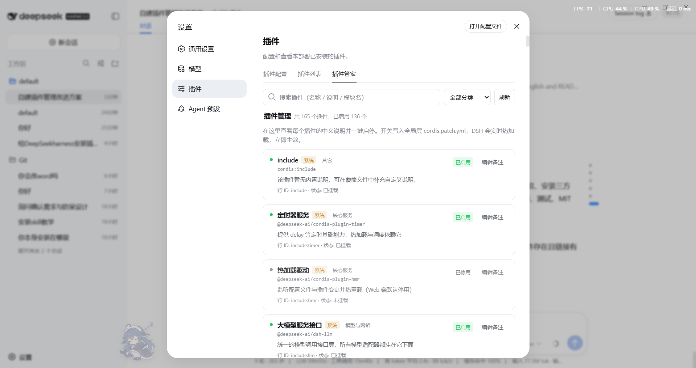

# dsh-plugin-manager

A graphical plugin manager for DeepSeek Harness. It adds a **Plugin Manager** tab under *Settings → Plugins*, showing every plugin with a Chinese name and a plain-language description, a one-click enable/disable switch (written to the global patch file and hot-reloaded live), and in-UI notes editing (stored in a local override file).

[中文文档](README.zh.md)



## Why it exists

- The built-in "Plugin list" shows only English module names with no descriptions — once you install many plugins, nobody can tell what each one does;
- Enable/disable previously required hand-editing cordis.patch.yml — this plugin performs line-level surgical edits, preserving comments and `!!js` expressions, touching only the target row's `disabled` field;
- Ships a built-in catalog of 165 entries (name + one-line description + category); unlisted plugins get a fallback and can be annotated in the UI;
- Notes (name/description) are editable directly in the settings UI — no config-file editing.

## Install

```bash
# Option 1: install from GitHub (recommended, same bundle mechanism as dsh-navbar)
dsh plugin --profile web add github:2768651338/dsh-plugin-manager#main

# Option 2: install from a zip (download from the Release page)
# unzip to a path without spaces, then:
dsh plugin --profile web add file:/<unzipped-dir>/dsh-plugin-manager

# Option 3: build locally (clone this repository)
pnpm build   # tsc + tsdown → lib/index.js (host half) and lib/client.js (browser half)
dsh plugin --profile web add file:./dsh-plugin-manager
```

Then **restart DeepSeek Harness** and open *Settings → Plugins → Plugin Manager*. The `lib/` artifacts are committed, so GitHub installs need no local build.

## Features

- **Chinese catalog**: 130+ built-in entries (name / description / category) with fallback and per-plugin customization;
- **One-click enable/disable**: toggles write to `~/.dsh/cordis.patch.yml` (global layer) and DSH's HMR watcher re-applies them within ~1 second; enabling writes an explicit `disabled: false` that overrides lower layers;
- **In-UI notes editing**: the "Edit notes" button on each card edits the Chinese name/description (saved to `~/.dsh/plugin-manager/catalog.json`), with one-click restore-to-default;
- **System protection**: bootstrap/transport/settings-shell rows cannot be disabled; `!!js`-expression-controlled rows are labeled and locked, preventing accidents;
- **Search & filter**: search by name/description/module, filter by category, enabled-count summary.

## How it works

- **Host half** (`lib/index.js`): registers the `pluginManager` cordis service (a Typert remote service) exposing `list` / `setEnabled` / `setOverride` / `removeOverride`. Toggles use surgical patch-file editing (comments and expressions preserved; re-reads the file before writing to merge concurrent manual edits).
- **Strict endpoint registration** (`lib/typert.host.js`): the package exports `./typert`, which the typert-loader registers as strict invocation definitions. This is the crucial part: when DSH boots in tsx source mode, the gateway and an external plugin can hold two copies of typert-protocol, making decorator markers invisible across copies (symptom: 404 on every call). Strict registration goes through the shared registry and sidesteps module-instance identity entirely.
- **Browser half** (`lib/client.js`): mounts the `pluginManager` remote namespace (accessed through the inject-free `ctx.get()` channel to avoid a self-mount deadlock) and registers the Plugin Manager tab in the `settings.plugins.tab` slot.
- **Runtime dependencies**: the peer dependencies `@deepseek-ai/cordis` and `@deepseek-ai/dsh-typert-protocol` are provided by DSH's `profiles/node_modules` fallback links — no extra pnpm downloads.

## Custom notes

Click "Edit notes" on a card. Saving with both fields empty removes that plugin's customization. Power users can also edit `~/.dsh/plugin-manager/catalog.json` directly:

```json
{
  "@dsh-external/dsh-navbar": { "name": "对话导航条", "desc": "对话区右缘的消息节点导航" }
}
```

Precedence: override file > built-in catalog > English short name.

## Project structure

```text
src/
  index.ts              host half: PluginManagerGateway (list / setEnabled / setOverride / removeOverride)
  patch-file.ts         surgical patch-file editor (pure functions)
  catalog.ts            built-in catalog + system-protection set
  types.ts              shared plain data types
  typert-host.ts        strict endpoint registration artifact (./typert)
  client/
    index.ts            browser half: mount remote namespace + register the tab
    remote.ts           client remote artifact (strict zod codecs)
    PluginManagerTab.tsx tab UI (list / toggles / notes editing)
    locales.ts          zh/en dictionaries
cordis.patch.yml        bundle patch (inserts the plugin-manager row)
lib/                    built artifacts (committed; GitHub installs skip building)
tests/                  smoke / end-to-end tests
```

## Tests

```bash
node tests/patch-file.smoke.mjs   # 9 smoke tests for the patch editor
node tests/host-gateway.e2e.mjs   # host gateway end-to-end (incl. override-file contents)
node tests/claims.e2e.mjs         # endpoint claims under plain-node and tsx source launch
```

> Absolute paths inside the test scripts point at the local DSH installation and are development-only; they do not affect runtime behavior.

## Notes

- Disabling browser-side plugins (ui-* / client-*) fully unloads them only after a page refresh;
- When hand-editing the patch file, keep the row-block structure (a `- ` dash at column 0);
- Uninstall: `dsh plugin --profile web remove @dsh-external/dsh-plugin-manager`.

## License & disclaimer

MIT License (see [LICENSE](LICENSE)). This plugin is built on DeepSeek Harness's public plugin mechanism, is not affiliated with DeepSeek, and contains no private official code.
