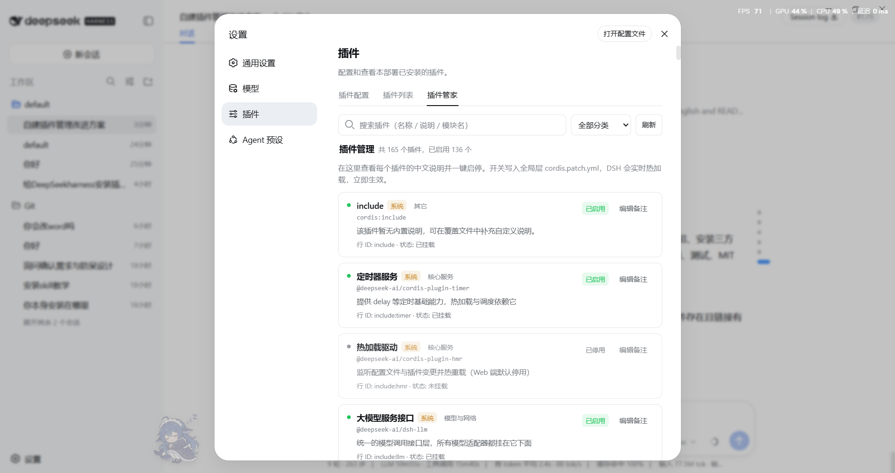

<!-- English version. 中文文档见 docs/lang/README_ZH.md -->
<div align="center">

# dsh-plugin-manager

> **Every plugin finally speaks for itself** — Chinese names, plain-language descriptions, one-click enable/disable, and in-UI notes editing for DeepSeek Harness.

[](LICENSE)
[](https://github.com/deepseek-ai/deepseek-harness)
[](https://github.com/2768651338/dsh-plugin-manager/releases)
[](https://www.typescriptlang.org)
[](https://react.dev)
[](https://github.com/topics/dsh-plugin)
[](https://awesome-dsh-plugin.com)

<br>



**Settings → Plugins → Plugin Manager** · 165 plugins cataloged, one click to toggle, notes edited in place.

<br>

[Overview](#overview) · [Compatibility](#compatibility) · [Install / Uninstall](#install--uninstall) · [Quick Start](#quick-start) · [Configuration](#configuration) · [Permissions & Data](#permissions--data) · [Features](#features) · [Troubleshooting](#troubleshooting) · [Development](#development)

[**中文**](docs/lang/README_ZH.md) · [**Español**](docs/lang/README_ES.md) · [**日本語**](docs/lang/README_JA.md) · [**Deutsch**](docs/lang/README_DE.md) · [**Русский**](docs/lang/README_RU.md) · [**Português**](docs/lang/README_PT.md) · [**한국어**](docs/lang/README_KO.md)

</div>

---

> 🆕 **2026-10-01 · v0.7.0** — Adapted to **DSH 0.2.0** (`0.2.0-rc.2`) with a
> **dual-form codec artifact** that registers on both the 0.1.x and the 0.2.0
> typert chains (0.2.0 switched from zod instances to `create()` factories) —
> the full e2e suite passes against **both** `0.2.0-rc.2` and `0.1.5-rc.3`.
> Catalog gained the 0.2.0 rows (`dsh-hmr`, the DeepSeek LLM split, the official
> plugin manager rows); peer ranges widened to cover `0.2.0-rc.0`+. Hot-reload
> still works on 0.2.0 (the `dsh-hmr` service watches the global patch file).
>
> 🆕 **2026-10-01 · v0.6.0** — Adapted to **DSH 0.1.5** (`0.1.5-rc.3`): the host
> and client halves build and pass the full e2e suite against the 0.1.5-rc.3
> package set, and the test suite now runs hermetically (no local DSH install
> needed). Also fixes a locale-namespace collision with `@linxin666/dsh-web-ui-all`.
>
> 🆕 **2026-08-14 · v0.3.0** — In-UI notes editing is live: click **Edit notes** on any card to rename a plugin or rewrite its description in place. No more hand-editing `catalog.json`.
>
> 🏷️ **v0.4.0** — Package renamed to the owner-controlled scope @2768651338/dsh-plugin-manager (previous @dsh-external/* scope was not authorized).
>
> 🔧 **v0.2.x** — Fixed endpoint 404 under tsx source launch (strict `./typert` registration) and the cordis inject access (`ctx.get` channel).

---

## Overview

**Problem.** The built-in "Plugin list" in DeepSeek Harness shows only English module names with no descriptions — once you install many plugins, nobody can tell what each row does. Enable/disable previously required hand-editing `cordis.patch.yml`, which is easy to break.

**Who it's for.** Every DeepSeek Harness user, especially people who install many plugins and want to know what each one does, toggle them safely, and annotate the ones the catalog doesn't cover.

| Pain | Before | With this plugin |
|------|--------|------------------|
| Plugin list is meaningless | English module names only, no clue what each row does | Chinese name + one-line description + category for every plugin |
| Toggling is manual | Hand-edit `cordis.patch.yml` (easy to break) | One-click switch, surgical line-level edits, hot-reloaded in ~1s |
| Unknown plugins stay mysterious | Fallback text only | Add your own notes directly in the UI |
| Nothing is safe from fat fingers | Any row can be disabled | System rows locked, `!!js`-controlled rows labeled |

## Compatibility

| Item | Value |
|------|-------|
| DSH version | **0.2.0** line (verified against the `0.2.0-rc.2` package set) and **0.1.x** (dual-form codecs re-verified against `0.1.5-rc.3`) |
| Verified on | **2026-10-01**, web profile, Windows — host chain + strict typert registration covered by the e2e suite on both 0.2.0-rc.2 and 0.1.5-rc.3 |
| Install mechanism | `dsh plugin --profile web add` (bundle patch + dual-face row) |
| Depends on | typert-loader / api-gateway / client-modules rows shipped in `dsh-base` + `dsh-web-app` |

> The official launcher boots via tsx from source; this plugin's strict `./typert` registration is specifically designed to work under both plain-node and tsx source launch (covered by `tests/claims.e2e.mjs`). If you run a different DSH version, re-run the test suite before reporting issues.
>
> **DSH 0.2.0 note:** the `dsh-base` bundle now ships an official plugin manager (`@deepseek-ai/dsh-plugin-manager`, row id `plugin-manager`). This plugin's bundle patch inserts the same row id, and the later bundle layer wins — so installing this plugin replaces the official host row. The official *sidebar* panel (`@deepseek-ai/dsh-client-ui-plugin-manager`) is a separate surface and may coexist with this plugin's Settings tab.

## Install / Uninstall

```bash
# Install (recommended, same bundle mechanism as dsh-navbar)
dsh plugin --profile web add github:2768651338/dsh-plugin-manager#main

# Alternative: install from a zip (download from the Release page), unzip to a path without spaces, then:
dsh plugin --profile web add file:/<unzipped-dir>/dsh-plugin-manager

# Alternative: build locally (clone this repository)
pnpm build   # tsc + tsdown → lib/index.js (host half) and lib/client.js (browser half)
dsh plugin --profile web add file:./dsh-plugin-manager
```

> After installing, **restart DeepSeek Harness** and press **Ctrl+F5** once. Open *Settings → Plugins → Plugin Manager*. The `lib/` artifacts are committed, so GitHub installs need no local build.

| Action | Command |
|--------|---------|
| Upgrade | `dsh plugin --profile web update` (or re-run the `add` command), then restart DSH |
| Disable (temporarily) | Click **停用/Disable** on the plugin's own card in Plugin Manager — the row stays installed |
| Remove | `dsh plugin --profile web remove @2768651338/dsh-plugin-manager`, then remove its rows from `cordis.patch.yml` if any |

## Quick Start

Minimal reproducible walkthrough (2 minutes):

```bash
# 1. Install
dsh plugin --profile web add github:2768651338/dsh-plugin-manager#main
# 2. Restart DeepSeek Harness, press Ctrl+F5 in the web page
```

3. Open **Settings → Plugins → Plugin Manager** — you see the full catalog with Chinese names and descriptions.
4. Toggle one plugin: search for `trajectory`, click **停用 (Disable)** on the *轨迹视图* card → the row turns 已停用 within ~1 second (host-side effect; browser-side plugins fully unload after a page refresh).
5. Annotate one plugin: click **编辑备注 (Edit notes)** on the *联网搜索* card, rename it and add a note, click **保存 (Save)** → the card updates immediately; **恢复默认 (Restore default)** reverts it.

## Configuration

| Item | Details |
|------|---------|
| Plugin-level options | None — the plugin needs no configuration; install-and-use |
| Toggle file | `~/.dsh/cordis.patch.yml` (global layer, hot-reloaded by DSH) |
| Notes override file | `~/.dsh/plugin-manager/catalog.json` (auto-created on first save) |
| Environment variables | None of its own; follows DSH's `DSH_HOME` resolution for the files above |
| Defaults | Unlisted plugins fall back to built-in catalog → English short name → fallback text |
| Sensitive items | None — no keys, tokens, or credentials are read or stored |

## Permissions & Data

| Scope | What it touches |
|-------|-----------------|
| Files (read) | `cordis.patch.yml`, `plugin-manager/catalog.json`, the in-process loader plugin list, and the profile `package.json` (backup) |
| Files (write) | `~/.dsh/cordis.patch.yml` (toggle rows), `~/.dsh/plugin-manager/catalog.json` (notes), and the profile `package.json` (restore) — inside the DSH home only |
| Network | None. The browser half talks only to your local DSH `/api` RPC endpoint |
| Credentials | Never read |
| User data | Never read (no access to sessions, messages, or prompts) |

## Features

| Feature | Description |
|---------|-------------|
| 📚 Chinese catalog | 190+ built-in entries (name / description / category), fallback + per-plugin customization |
| 🔘 One-click toggle | Writes `~/.dsh/cordis.patch.yml` (global layer); DSH's HMR watcher re-applies within ~1 second; enabling writes an explicit `disabled: false` that overrides lower layers |
| ✏️ In-UI notes | "Edit notes" on each card edits the Chinese name/description (`~/.dsh/plugin-manager/catalog.json`), with one-click restore-to-default |
| 🛡️ Safety guards | Bootstrap/transport/settings-shell rows locked as "System"; `!!js`-expression rows labeled "Expression-controlled" |
| 🔍 Search & filter | Search by name/description/module, filter by category, enabled-count summary |
| 💾 Backup & restore | Export notes + plugin list (profile `dependencies`/`bundles`) + the enable/disable patch to one JSON file; import merges (never removes your existing entries) and prints the exact reinstall command |

## How It Works

| Half | File | Role |
|------|------|------|
| Host | `lib/index.js` | Registers the `pluginManager` cordis service (Typert remote): `list` / `setEnabled` / `setOverride` / `removeOverride` / `exportBackup` / `importBackup`. Toggles use surgical patch-file editing — comments and `!!js` expressions preserved, file re-read before write to merge concurrent edits. |
| Host | `lib/typert.host.js` | Exports `./typert`; the typert-loader registers it as **strict invocation definitions**. Crucial fix: under tsx source launch the gateway and an external plugin can hold two copies of typert-protocol — decorator markers are invisible across copies (symptom: every call 404s). Strict registration goes through the shared registry, sidestepping module-instance identity. |
| Browser | `lib/client.js` | Mounts the `pluginManager` remote namespace via the inject-free `ctx.get()` channel (avoids a self-mount deadlock) and registers the Plugin Manager tab in the `settings.plugins.tab` slot. |

> Runtime dependencies: `@deepseek-ai/cordis` and `@deepseek-ai/dsh-typert-protocol` resolve through DSH's `profiles/node_modules` fallback links — no extra pnpm downloads.

## Custom Notes

Click **Edit notes** on any card. Saving with both fields empty removes that plugin's customization. Power users may still edit `~/.dsh/plugin-manager/catalog.json` directly:

```json
{
  "@dsh-external/dsh-navbar": { "name": "对话导航条", "desc": "对话区右缘的消息节点导航" }
}
```

Precedence: override file > built-in catalog > English short name.

## Troubleshooting

| Symptom | Fix |
|---------|-----|
| The tab doesn't appear | Restart DeepSeek Harness, then Ctrl+F5 the page (client bundles load at boot) |
| "暂时无法读取插件" with an error block | Read the gray error detail under the message: `pluginManager.list failed: ...` / `transport failure ...` and match it below |
| Error mentions **404** or `invocation-unavailable` | Your installed version is older than 0.2.0 (missing `./typert` strict registration) — update and restart |
| `cannot get property "remote.pluginManager" without inject` | Version older than 0.2.2 — update and refresh |
| A toggle doesn't seem to work | Check `~/.dsh/cordis.patch.yml` keeps row-block structure (a `- ` dash at column 0); rows labeled "表达式控制" are `!!js`-controlled — edit the config file directly |
| pnpm warns `peer range @deepseek-ai/*@* does not match resolved 0.2.0-rc.2` | Harmless — DSH ships these as prereleases and semver `*` doesn't match them. v0.7.0+ declares `>=0.1.0-rc.0 \|\| >=0.1.5-rc.0 \|\| >=0.2.0-rc.0`; for other plugins add `peerDependencyRules.allowAny: ['@deepseek-ai/*']` to `pnpm-workspace.yaml` |
| Where are the logs? | DSH host startup log (launcher console) for host errors; browser DevTools (F12) console for client errors |
| Rollback | Remove the plugin's rows from `cordis.patch.yml`, use **恢复默认** for notes, or uninstall with the `remove` command above |

## Project Structure

```text
src/
  index.ts              host half: PluginManagerGateway (list / setEnabled / setOverride / removeOverride)
  patch-file.ts         surgical patch-file editor (pure functions)
  catalog.ts            built-in catalog + system-protection set
  types.ts              shared plain data types
  typert-host.ts        strict endpoint registration artifact (./typert)
  client/
    index.ts            browser half: mount remote namespace + register the tab
    remote.ts           client remote artifact (strict zod codecs)
    PluginManagerTab.tsx tab UI (list / toggles / notes editing)
    locales.ts          zh/en dictionaries
cordis.patch.yml        bundle patch (inserts the plugin-manager row)
lib/                    built artifacts (committed; GitHub installs skip building)
tests/                  smoke / end-to-end tests
```

## Development

```bash
pnpm build                      # tsc + tsdown
pnpm test                       # patch-file + backup smoke, claims/gateway/host e2e
node tests/patch-file.smoke.mjs # 9 smoke tests for the patch editor
node tests/host-gateway.e2e.mjs # host gateway end-to-end (incl. override-file contents)
node tests/claims.e2e.mjs       # endpoint claims under plain-node and tsx source launch
```

> The DSH host packages the tests boot against (`dsh-app-boot`, `dsh-typert-*`,
> `dsh-api-gateway`, …) are pinned devDependencies at the DSH `0.2.0-rc.2`
> versions, and every entry path is resolved via `import.meta.resolve` — no
> local DSH installation is needed to build, test, or typecheck. The dual-form
> codec artifacts are regression-verified by temporarily flipping the pins back
> to `0.1.5-rc.3` and re-running the full suite (both generations must pass).

**Contributing.** Fork → change → `pnpm build` → run the tests above → open a PR against `main`. Small fixes (docs, catalog entries, translations) are welcome without prior discussion. Report issues with the DSH version and the exact error detail shown in the tab.

## License & Security

**License**: MIT — see [LICENSE](LICENSE). Built on DeepSeek Harness's public plugin mechanism, not affiliated with DeepSeek.

**Security**: this plugin reads no credentials and sends nothing over the network. To report a security issue privately, use GitHub's **Report a vulnerability** on the [Security tab](../../security) — do not open a public issue with exploit details.

---

## Star History

<a href="https://www.star-history.com/?repos=2768651338%2Fdsh-plugin-manager&type=date&legend=top-left">
  <picture>
    <source media="(prefers-color-scheme: dark)" srcset="https://api.star-history.com/image?repos=2768651338/dsh-plugin-manager&type=date&theme=dark&legend=top-left" />
    <source media="(prefers-color-scheme: light)" srcset="https://api.star-history.com/image?repos=2768651338/dsh-plugin-manager&type=date&legend=top-left" />
    
  </picture>
</a>

---

<div align="center">

MIT License © [2768651338](https://github.com/2768651338)

</div>
